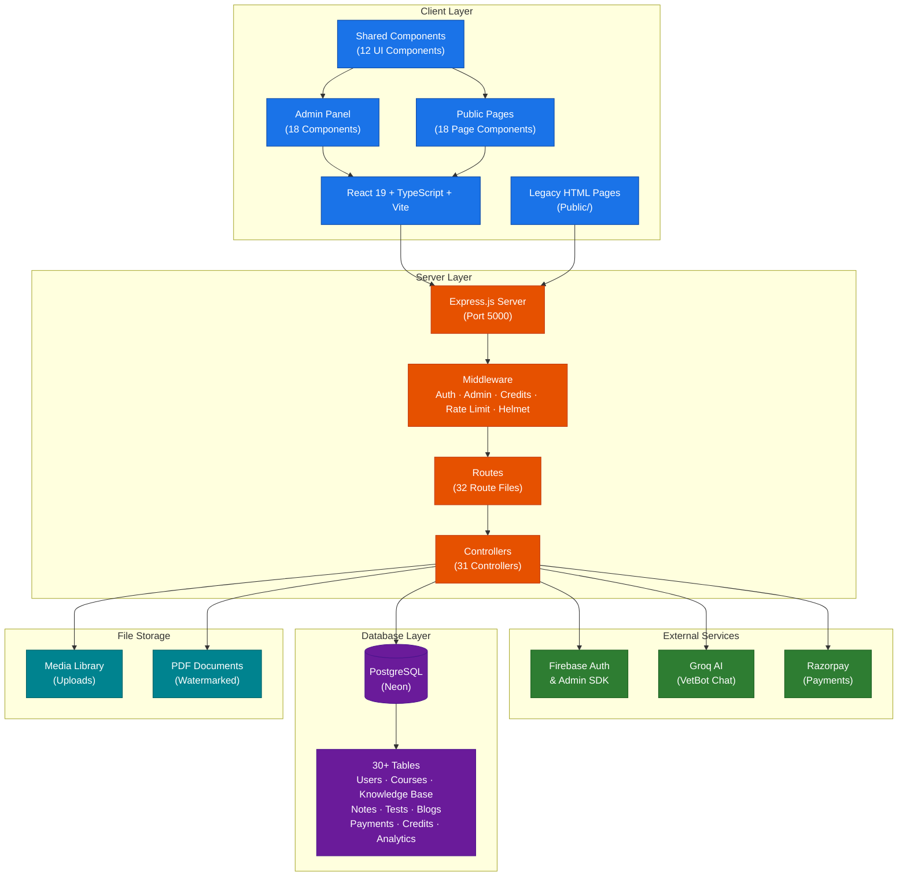

# VetCrack — Veterinary Knowledge Platform

A comprehensive full-stack veterinary knowledge and education platform built with **Node.js/Express** (backend) and **React/TypeScript/Vite** (frontend). Designed for veterinary students, professionals, and pet owners to access courses, reference materials, AI-powered assistance, and community content.

## Features

- **Course Management** — Structured courses with sections, PDFs, and rich content
- **Knowledge Base** — Categorized/subcategorized articles covering anatomy, physiology, diseases, medicines, breeds, procedures, vaccines, and diagnostic tests
- **AI Chat Assistant (VetBot)** — Groq-powered AI assistant with voice input and Hinglish language support
- **Tests & MCQs** — Practice tests with multiple-choice questions and attempt tracking
- **Notes System** — Three-level hierarchical notes (categories → subcategories → pages)
- **Medicine & Drug Database** — Searchable veterinary drug reference with relations
- **Payment Integration** — Credit-based monetization via Razorpay
- **Blog Platform** — SEO-optimized blog posts with rich content
- **Admin Dashboard** — Full admin panel for managing all content types, users, analytics, and settings
- **User System** — Firebase Auth + JWT-based authentication with role management
- **Credit System** — Users earn/purchase credits to access premium features (chat, content)
- **SEO & Analytics** — Built-in SEO metadata management and page view/search analytics
- **Search** — Full-text search across knowledge base, articles, medicines, and more

## Architecture



## Tech Stack

### Backend
| Component | Technology |
|-----------|------------|
| Runtime | Node.js |
| Framework | Express 4 |
| Database | PostgreSQL (Neon) |
| Auth | Firebase Admin SDK + JWT |
| Payments | Razorpay |
| AI/ML | Groq AI (xAI API) |
| Middleware | Helmet, CORS, Rate Limiting |

### Frontend
| Component | Technology |
|-----------|------------|
| Framework | React 19 |
| Language | TypeScript 6 |
| Build Tool | Vite 8 |
| Styling | Tailwind CSS 4 |
| Routing | React Router 6 |
| State/Data | TanStack React Query |
| Animations | Framer Motion |
| Icons | Lucide React |

### Database (PostgreSQL)
30+ tables covering users, courses, knowledge base (articles, diseases, medicines, breeds, procedures, vaccines, diagnostic tests), notes (3-level hierarchy), tests/MCQs, blogs, payments, credits, analytics, and SEO.

## Project Structure

```
vet/
├── server.js                     # Express entry point
├── controllers/                  # 31 route controllers
├── routes/                       # 32 Express route definitions
├── db/                           # PostgreSQL pool, schema, seeds
├── middleware/                    # Auth, admin, credit middleware
├── firebase/                     # Firebase Admin SDK & client config
├── utils/                        # Helpers & PDF watermark utility
├── public/                       # Legacy HTML/CSS/JS frontend
│   ├── index.html                # Landing page + VetBot AI widget
│   ├── pages/                    # 12 static HTML pages
│   ├── js/                       # 9 client-side JS files
│   └── css/                      # Stylesheets
└── client/                       # React + TypeScript + Vite frontend
    ├── src/
    │   ├── admin/                # 18 admin panel components
    │   ├── pages/                # 18 public page components
    │   ├── components/           # 12 shared UI components
    │   ├── lib/                  # API client & utilities
    │   └── types/                # TypeScript definitions
    └── public/                   # Favicon & static assets
```

## Setup

### Prerequisites
- Node.js 18+
- PostgreSQL database (Neon or local)
- Firebase project (for auth)
- Razorpay account (for payments)
- Groq API key (for AI chat)

### Installation

```bash
git clone https://github.com/ayushdixit1-av/vet-project.git
cd vet-project

# Install backend dependencies
npm install

# Install frontend dependencies
cd client && npm install && cd ..

# Set up environment variables
cp .env.example .env
# Edit .env with your credentials

# Initialize database schema
npm run seed

# Start development
npm run dev
```

The server runs on `http://localhost:5000` and the frontend dev server on `http://localhost:5173`.

### Build for Production

```bash
npm run build    # Builds React frontend
NODE_ENV=production npm start   # Start production server
```

## API Endpoints

The server exposes 30+ API groups under `/api/`, including:
- `/api/auth` — Authentication & user management
- `/api/courses`, `/api/sections`, `/api/contents` — Course content
- `/api/knowledge-categories`, `/api/articles` — Knowledge base
- `/api/medicines`, `/api/diseases`, `/api/breeds`, `/api/vaccines`, `/api/procedures`, `/api/diagnostic-tests` — Reference data
- `/api/tests`, `/api/mcqs` — Testing system
- `/api/notes`, `/api/note-categories`, `/api/note-pages` — Notes system
- `/api/chat` — AI chat assistant
- `/api/credits`, `/api/payment` — Credit & payment management
- `/api/blogs` — Blog platform
- `/api/search` — Full-text search
- `/api/analytics` — Platform analytics
- `/api/seo` — SEO metadata
- `/api/media` — Media library

## License

MIT
